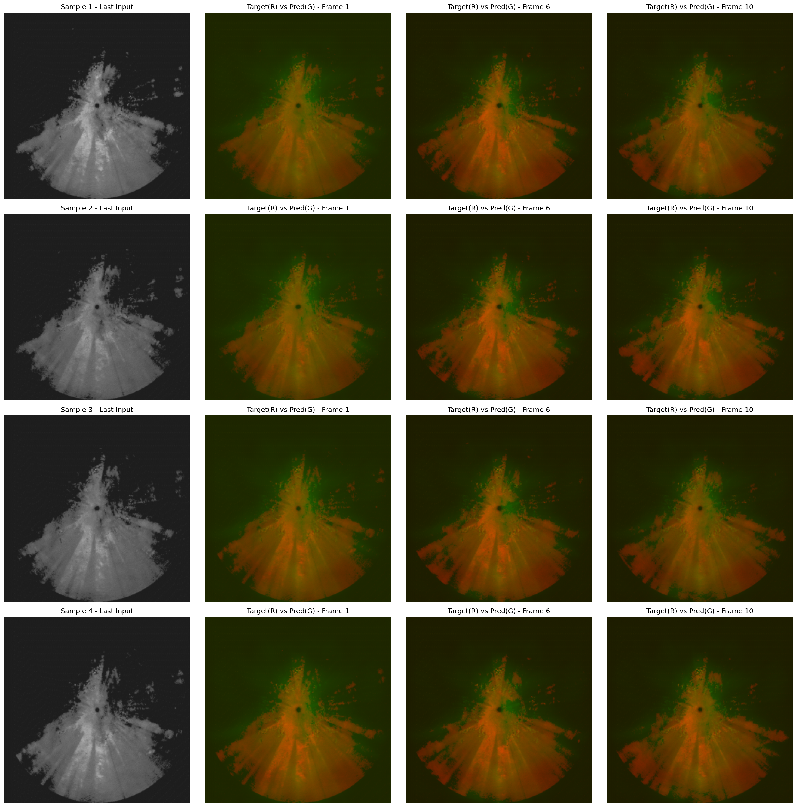

# Radar‑Echo‑Nowcasting‑CNN‑LSTM
> 📡 基于CNN‑LSTM混合架构实现雷达回波外推短时临近预报
智慧气象应用开发实践课程设计 | PyTorch实现，RTX4060‑8G显卡硬件适配优化



## 📖项目简介
雷达回波外推是短时临近降水预报关键技术。本项目构建CNN‑LSTM时空预测模型，使用CNN编码器提取雷达图像空间特征，LSTM建模时序依赖，解码器重构未来雷达回波图像。

针对传统MSE损失忽视强回波预测问题，采用**加权MSE + SSIM联合损失函数**；引入**多阈值CSI关键成功指数**评估不同强度回波预测效果。
结合梯度累积、混合精度AMP、学习率预热+余弦退火、梯度裁剪、早停、检查点断点续训，在RTX4060 8G显卡完成训练。

- 输入：连续10帧256×256灰度雷达图像
- 输出：预测未来10帧雷达回波
- 数据集：943组雷达样本，训练集/验证集按8:2划分

### 📊关键实验指标
|指标 |数值 |
|---|---|
|MSE |0.0080 |
|MAE |0.0566 |
|SSIM |0.7562 |
|CSI@0.184 |0.5606 |
|CSI@0.3 |0.1614 |

## 🧰环境依赖
Python 3.9+, PyTorch 2.0+
```bash
pip install -r requirements.txt
